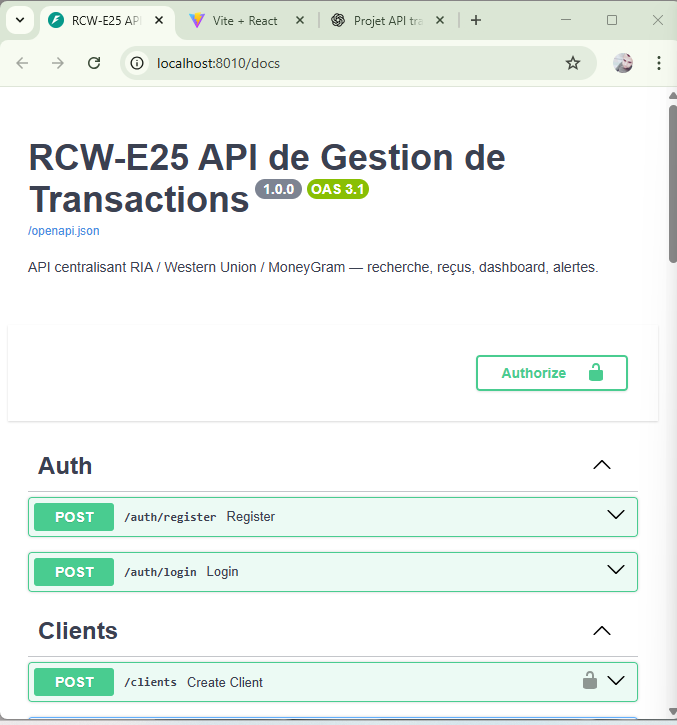

# Rapport Technique – RCW-E25 (MVP)

## 1. Contexte & Objectifs
- Centraliser les transactions de transfert d’argent pour **RIA**, **Western Union (WU)** et **MoneyGram (MG)**.
- Permettre : authentification JWT, enregistrement de transactions, recherche multi-critères, reçus JSON, dashboard de synthèse, alertes simples.

## 2. Architecture & Rôle de Docker
- **Docker Compose** orchestre 2 services :
  - `db` : **PostgreSQL 15** (stockage persistant via volume `db_data`)
  - `api` : **FastAPI + Uvicorn** (Python 3.11)
- Communication : **API ⇄ DB** via réseau interne Docker.
- (Frontend React fourni séparément hors compose, lancé avec `npm run dev`.)

## 3. Backend (FastAPI)
- **Libs clés** : FastAPI, SQLAlchemy 2 (ORM, `Mapped[]`), Pydantic v2, pydantic-settings, psycopg2-binary, python-jose (JWT), passlib[bcrypt], bcrypt==4.0.1.
- **Structure (principale)** :
  - `app/main.py` : création app, enregistrement des routers
  - `app/db.py` : SessionLocal, Base
  - `app/models.py` : `User`, `Client`, `Transaction`, `ExchangeRate`, `ActionLog`, `Alert`, + Enums `UserRole`, `ServiceType (RIA/WU/MG)`, `TxStatus`
  - `app/schemas.py` : schémas Pydantic d’E/S
  - `app/routers/` : `auth`, `clients`, `transactions`, `rates`, `reports`
  - `app/core/config.py` : settings (variables d’env)
  - `app/utils/receipts.py` : génération de reçu **JSON**
- **Sécurité** : JWT (HS256), mot de passe hashé bcrypt.
- **CORS** : issu d’une variable d’env `CORS_ORIGINS` (format tableau JSON).

## 4. Fonctionnalités livrées (MVP)
- **Auth JWT** : `/auth/login` (admin seedé).
- **Clients** : `POST /clients`, `GET /clients`.
- **Transactions** :
  - `POST /transactions` (client, service RIA/WU/MG, montant, devise, statut, `tx_number` unique)
  - `GET /transactions` (filtres : client, service, statut, période)
- **Reçu** : `GET /transactions/{id}/receipt.json`.
- **Taux de change** : `POST /rates`, `GET /rates` (historique).
- **Dashboard** : `GET /reports/summary`
  - Totaux par service, par devise, par pays
  - Total converti vers `DEFAULT_BASE_CURRENCY` avec le **dernier** taux connu
- **Alertes** :
  - Montant ≥ `SUSPICIOUS_AMOUNT` (ex. 3000)
  - Multiples transactions d’un même client dans une fenêtre (`SUSPICIOUS_WINDOW_MINUTES`) ≥ `SUSPICIOUS_MAX_TX`

## 5. Frontend (React minimal + CSS)
- **Pages** : Login, Dashboard, Transactions (liste + filtres), Nouvelle transaction, Nouveau client.
- **Intégration** : Axios + interceptor (Bearer), React Router, **CSS simple** (pas de Tailwind).
- **Config** : `.env` du front → `VITE_API_URL=http://localhost:8010`.

## 6. Variables d’environnement (API)
- `DATABASE_URL=postgresql+psycopg2://rcw:rcwpass@db:5432/rcwdb`
- `JWT_SECRET` (à changer en prod)
- `JWT_ALGO=HS256`
- `ACCESS_TOKEN_EXPIRE_MINUTES=120`
- `CORS_ORIGINS='["http://localhost:5173","http://127.0.0.1:5173"]'`
- `SUSPICIOUS_AMOUNT=3000`
- `SUSPICIOUS_WINDOW_MINUTES=30`
- `SUSPICIOUS_MAX_TX=3`
- `DEFAULT_BASE_CURRENCY=CAD`

## 7. Déploiement (non livré — pistes)
> **Non implémenté dans cette version.**
- **Option VPS + Caddy (HTTPS auto)** :
  - Ajouter un service `caddy` dans `docker-compose.yml`
  - DNS : `api.domaine.com` → reverse_proxy `rcw_api:8000`
  - Builder le front (`npm run build`) et servir `/web/dist` statiquement.
- **Option PaaS** : API (Dockerfile backend) + DB managée (Render/Railway/Fly.io), front (Netlify/Vercel) avec `VITE_API_URL` sur l’URL publique de l’API.

## 8. Limites / “Non implémenté dans cette version”
- **PDF** : reçus PDF non générés (JSON uniquement).
- **Rôles avancés** : règles d’autorisation fines par endpoint (MVP seulement).
- **Pagination / tri** : non implémentés sur listes.
- **Export CSV/Excel** : non.
- **Notifications (email/SMS)** : non.
- **Taux auto** : pas de fetch externe, seulement création manuelle.
- **CI/CD** : pas de pipeline GitHub Actions, pas de push image registry.
- **Déploiement** : aucune stack prod prête dans le repo (pistes fournies ci-dessus).
- **Tests** : pas de tests unitaires/intégration.
- **Réinitialisation mot de passe** : non.

## 9. Sécurité (reco)
- Changer `JWT_SECRET`, restreindre `CORS_ORIGINS`.
- Reverse proxy HTTPS (Caddy/Traefik/Nginx) en prod.
- Sauvegardes régulières du volume DB ou DB managée.

## 10. Scénario de validation
1. Login admin `/auth/login` → `Authorize` Swagger.
2. Créer quelques clients → `/clients`.
3. Ajouter des **rates** → `/rates`.
4. Enregistrer des transactions variées (RIA/WU/MG, montants/devise/statuts différents).
5. Filtrer `/transactions` et consulter `/reports/summary`.
6. Consulter un reçu JSON.
    

    //conteneur sur DOCKER:
    

    //APi documnté sur swagger:
    

    